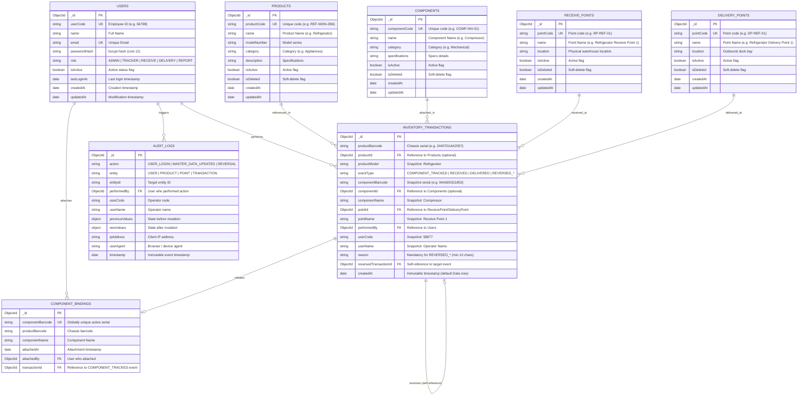

# 01. Entity-Relationship (ER) Diagram
## MongoDB Atlas / Mongoose Schema Architecture

### Mermaid Entity-Relationship Diagram

```mermaid
erDiagram
    USERS ||--o{ INVENTORY_TRANSACTIONS : "performs"
    USERS ||--o{ AUDIT_LOGS : "triggers"
    USERS ||--o{ COMPONENT_BINDINGS : "attaches"

    PRODUCTS ||--o{ INVENTORY_TRANSACTIONS : "referenced_in"
    COMPONENTS ||--o{ INVENTORY_TRANSACTIONS : "attached_in"
    RECEIVE_POINTS ||--o{ INVENTORY_TRANSACTIONS : "received_at"
    DELIVERY_POINTS ||--o{ INVENTORY_TRANSACTIONS : "delivered_at"

    INVENTORY_TRANSACTIONS ||--o| INVENTORY_TRANSACTIONS : "reverses (self-reference)"
    INVENTORY_TRANSACTIONS ||--o| COMPONENT_BINDINGS : "initiates"

    USERS {
        ObjectId _id PK
        string userCode UK "Employee ID (e.g. 66798)"
        string name "Full Name"
        string email UK "Unique Email"
        string passwordHash "bcrypt hash (cost 12)"
        string role "ADMIN | TRACKER | RECEIVE | DELIVERY | REPORT"
        boolean isActive "Active status flag"
        date lastLoginAt "Last login timestamp"
        date createdAt "Creation timestamp"
        date updatedAt "Modification timestamp"
    }

    PRODUCTS {
        ObjectId _id PK
        string productCode UK "Unique code (e.g. REF-WDN-2B6)"
        string name "Product Name (e.g. Refrigerator)"
        string modelNumber "Model series"
        string category "Category (e.g. Appliances)"
        string description "Specifications"
        boolean isActive "Active flag"
        boolean isDeleted "Soft-delete flag"
        date createdAt
        date updatedAt
    }

    COMPONENTS {
        ObjectId _id PK
        string componentCode UK "Unique code (e.g. COMP-INV-01)"
        string name "Component Name (e.g. Compressor)"
        string category "Category (e.g. Mechanical)"
        string specifications "Specs details"
        boolean isActive "Active flag"
        boolean isDeleted "Soft-delete flag"
        date createdAt
        date updatedAt
    }

    RECEIVE_POINTS {
        ObjectId _id PK
        string pointCode UK "Point code (e.g. RP-REF-01)"
        string name "Point Name (e.g. Refrigerator Receive Point 1)"
        string location "Physical warehouse location"
        boolean isActive "Active flag"
        boolean isDeleted "Soft-delete flag"
        date createdAt
        date updatedAt
    }

    DELIVERY_POINTS {
        ObjectId _id PK
        string pointCode UK "Point code (e.g. DP-REF-01)"
        string name "Point Name (e.g. Refrigerator Delivery Point 1)"
        string location "Outbound dock bay"
        boolean isActive "Active flag"
        boolean isDeleted "Soft-delete flag"
        date createdAt
        date updatedAt
    }

    INVENTORY_TRANSACTIONS {
        ObjectId _id PK
        string productBarcode "Chassis serial (e.g. 2440701AK2057)"
        ObjectId productId FK "Reference to Products (optional)"
        string productModel "Snapshot: Refrigerator"
        string eventType "COMPONENT_TRACKED | RECEIVED | DELIVERED | REVERSED_*"
        string componentBarcode "Snapshot serial (e.g. 94A600321852)"
        ObjectId componentId FK "Reference to Components (optional)"
        string componentName "Snapshot: Compressor"
        ObjectId pointId FK "Reference to ReceivePoint/DeliveryPoint"
        string pointName "Snapshot: Receive Point 1"
        ObjectId performedBy FK "Reference to Users"
        string userCode "Snapshot: 58877"
        string userName "Snapshot: Operator Name"
        string reason "Mandatory for REVERSED_* (min 10 chars)"
        ObjectId reversedTransactionId FK "Self-reference to target event"
        date createdAt "Immutable timestamp (default Date.now)"
    }

    COMPONENT_BINDINGS {
        ObjectId _id PK
        string componentBarcode UK "Globally unique active serial"
        string productBarcode "Chassis barcode"
        string componentName "Component Name"
        date attachedAt "Attachment timestamp"
        ObjectId attachedBy FK "User who attached"
        ObjectId transactionId FK "Reference to COMPONENT_TRACKED event"
    }

    AUDIT_LOGS {
        ObjectId _id PK
        string action "USER_LOGIN | MASTER_DATA_UPDATED | REVERSAL"
        string entity "USER | PRODUCT | POINT | TRANSACTION"
        string entityId "Target entity ID"
        ObjectId performedBy FK "User who performed action"
        string userCode "Operator code"
        string userName "Operator name"
        object previousValues "State before mutation"
        object newValues "State after mutation"
        string ipAddress "Client IP address"
        string userAgent "Browser / device agent"
        date timestamp "Immutable event timestamp"
    }
```
